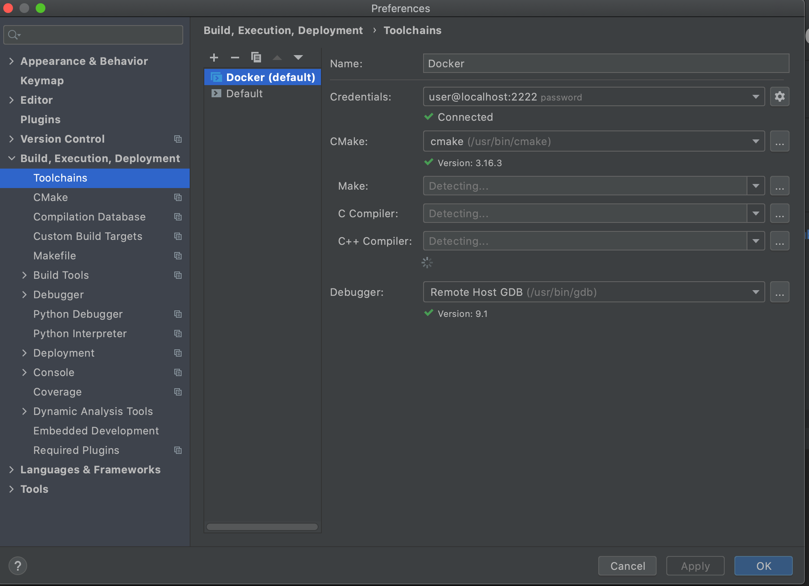
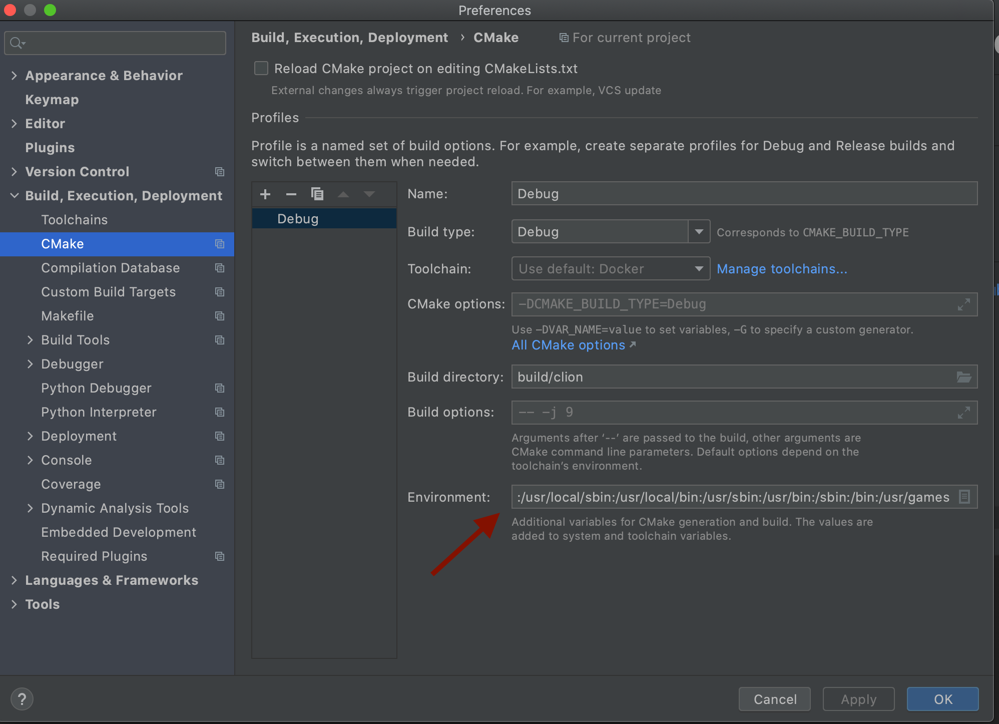

# nif: CLion Dev Environment Setup

This guide is an adaptation of https://www.allaban.me/posts/2020/08/ros2-setup-ide-docker/ to make it work with the `ade` development environment.

1. Install [Docker](https://docs.docker.com/engine/install/ubuntu/) (including `nvidia-container-toolkit`), [CLion](https://www.jetbrains.com/clion/) (request a [student license for activation](https://www.jetbrains.com/community/education/#students)).
   For a VSCode 'Look and Feel' in CLion, these two plugin are suggested: 
   - [One Dark Theme](https://plugins.jetbrains.com/plugin/11938-one-dark-theme) (Settings > Appearance & Behavior > Appearance > Theme)
    - [VSCode keymap](https://plugins.jetbrains.com/plugin/12062-vscode-keymap) (Settings > Keymap > Select VSCode)
   
   For a list of well-maintined themes: https://www.dunebook.com/best-clion-themes/

1. Install `ade` running `./getade.sh` or following [these steps](https://ade-cli.readthedocs.io/en/latest/install.html).

1. Run the folowing commands to configure the `ade` home directory, which is mounted by default as home directory in the `ade` containers.
   ```shell
   $ mkdir -p ~/adehome
   $ cd ~/adehome
   $ touch .adehome
   $ git clone --recurse-submodules git@github.com:AndreaFinazzi/nif.git
   ```
   A good reference is: https://autowarefoundation.gitlab.io/autoware.auto/AutowareAuto/installation-ade.html
   
1. Run: 
   ```shell
   $ export ADE_NAME=nif
   ```
   or add 
   ```shell
   if [[ "${PWD}" == *"adehome/nif"* ]]; then
      echo "setting ADE_NAME=nif"
      export ADE_NAME=nif
      source install/setup.zsh
   elif [[ "${PWD}" == *"adehome/AutowareAuto"* ]]; then
      echo "setting ADE_NAME=AutowareAuto"
      export ADE_NAME=AutowareAuto
      source install/setup.zsh
   fi
   ```
   to your `.bashrc` file.

1. Start the `ade` environment:
   ```shell
   $ cd nif
   $ ade start --update
   ```
   
1. Setup the ssh access (CLion's toolchain needs this). The login password is the same as host's username (`echo $USER`):
   ```shell
   $ ./adessh.sh
   ````
   Verify the installation running:
   ```shell
   $ ssh $USER@localhost -p2222
   ```
   
1. Open up your CLion settings/preferences and add a new remote toolchain. Call it whatever, but I’m calling it Docker. Use the credentials we used in the Dockerfile to setup SSH. Make sure to set it as the default.


1. Almost done. Run the last command (`ssh $USER@localhost -p2222`) or `ade enter` to open a shell into the container, and run:
   ```shell
   ~/nif/nifbuild
   ```
   and copy the output you get from the command. You need it in the next step.

1. Copy and paste the output into CLion’s CMake environment setting. 
   
1. Finally, close and reopen CLion and run `Tools > Resync with remote host` (`Ctrl + Shift + A` for action searching). At the end of the process, check that autocompletion is working properly.